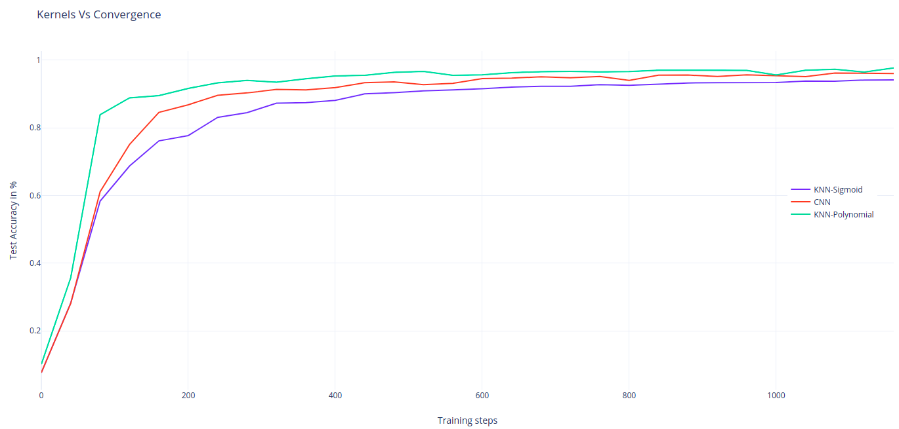
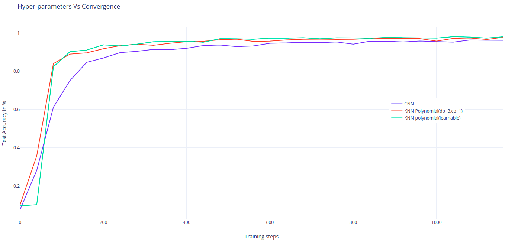
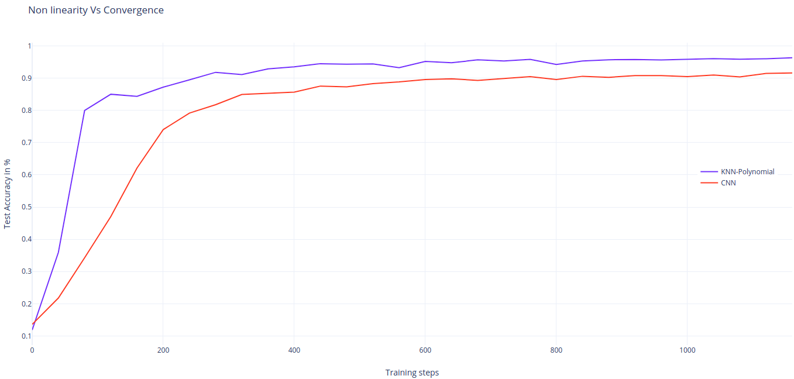

# Kervolutional Neural Networks
A Tensorflow implementation of the [Kervolutional Neural Networks (KNN)](https://arxiv.org/pdf/1904.03955.pdf) paper.

### Introduction

The KNN paper introduces an alternative operator to the usual convolution operator in CNNs, called *kernel convolution*.
The key idea is to use non-linear kernels to extract more complexe features without adding any additional parameters. According to the authoers, using kernels as a source of non-linearity is supposedly more effective than using activation functions and max pooling operations.

The purpose of this repository is to further test the KNN paper's claims and also further analyze why KNNs may or may not be better than CNNs and under which circumstances.

### Implementation

This code was tested using *TF2.3.1* and *python 3.8.5*.

```python
pip install -r requirements.txt
```

To launch training using *LeNet5* and *MNIST* dataset as described in section 4 of the original paper :
```python
python train_evaluate.py --lr 0.003 --batch_size 50 --epochs 20 --model_name lenetknn --kernel polynomial --trainable_kernel true
```

To launch training using *LeNet5* and *MNIST* dataset as described in section 6 of the mini paper included in this repo:
```python
python train_evaluate.py --batch_size 50 --epochs 20 --model_name lenetknn --kernel polynomial --trainable_kernel true --lr_search true
```

The figures below represent the test accuracy for the first epoch.  
<br />
<div align="center">
 
<br />

The figures below represent the test accuracy for the first epoch.  
<br />
<div align="center">
 
<br />

For the learnable parameter cp of the polynomial kernal, the initialization of this parameter is important for faster convergence. The curve in the figure below used 0.5 as initial value.

<br />
<div align="center">

<br />

To test the non-linearity impact on the performance, the activations are removed and the max pooling is replaced by an average pooling. These experiments are done using a lower leraning rate (0.0001)

<br />
<div align="center">

<br />

### Licence
MIT - original code can be found at https://github.com/amalF/Kervolution, who also uses the same license
